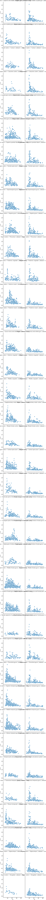

## Introduction

The scalp normal EEG activity  is well researched, but the  intractranial  and reconstructed sources is less.
Spatial pattern for specicic oscillation rhytms.
Lacation relared differences are descriptive,

## Data padded with zero

# analysis step
59 overlapping blocks of 2 s duration and 1 s step,

Brain oscillatory activity is  usually associated with specific regions. To check that I am trying to replicate analysis from @@frauscher_atlas_2018
Two datasets were analysed. Datails of the datasets are described in @frauscher_atlas_2018 and @liu2017

# Reproducing the clustering results

# Artifacts problems
In souces dataset there are some artefacts but I do not remove them
After running automatic ICA on the data I got several noisy components on many of the, most obvoious are

*Subject 3 has EOG artifacts*

*Subject 11 has  them too*

## Measurement of total power
Below comparison of total power for lobes

## Average spectra per segment
*THe plot for regions doesnt make much sense

##  Measurement of alpha oscilations

[//]: # (comment)

* compute highest peaks in alpha spectrum and later

## Summary

## To do
* test if hemisphere lobes are the same
*  computed power in normal and foofed alpha

# visualisation

## EECoG-Comp paper
ortical electrical activity is actually reflected in non-invasive electrophysiological scalp
recordings—distant and filtered by volume conduction effects,
