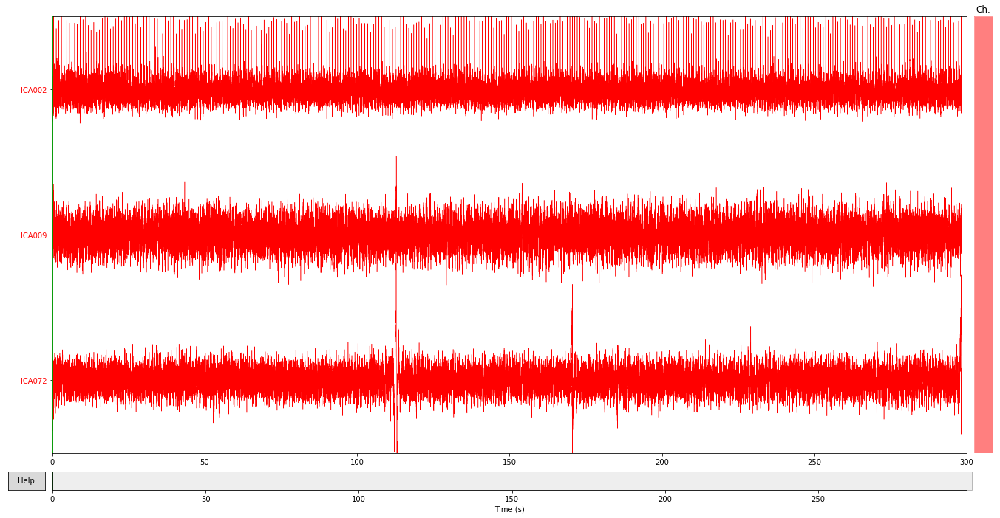
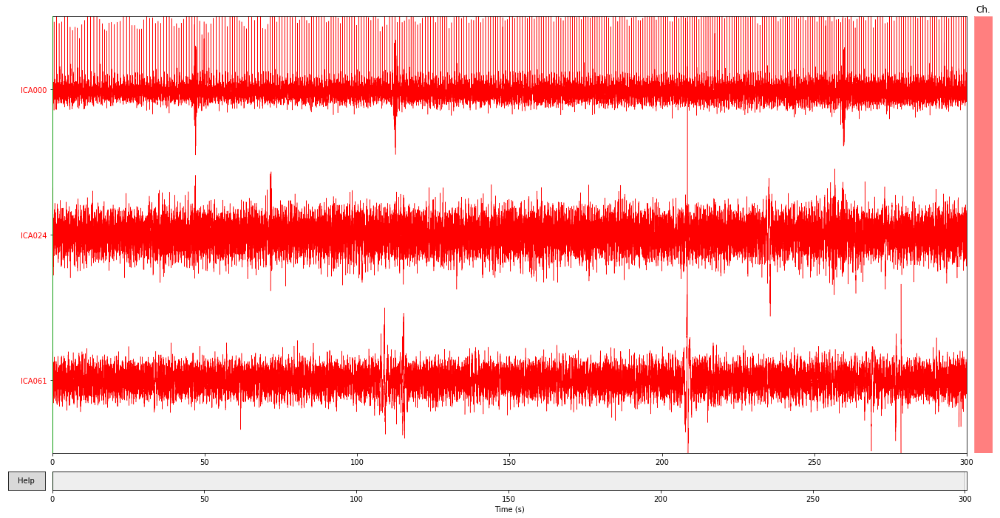

## Introduction
Two datasets were analysed. Datails of the datasets are described in @frauscher_atlas_2018 and @liu2017

# Artifacts problems
In souces dataset there are some artefacts but I do not remove them
After running automatic ICA on the data I got several noisy components on many of the, most obvoious are

*Subject 3 has EOG artifacts*

*Subject 11 has  them too*

## Measurement of total power
Below comparison of total power for lobes

## Average spectra per segment

##  Measurement of alpha oscilations

[//]: # (comment)

* compute highest peaks in alpha spectrum and later

## Summary

## To do
* test if hemisphere lobes are the same
