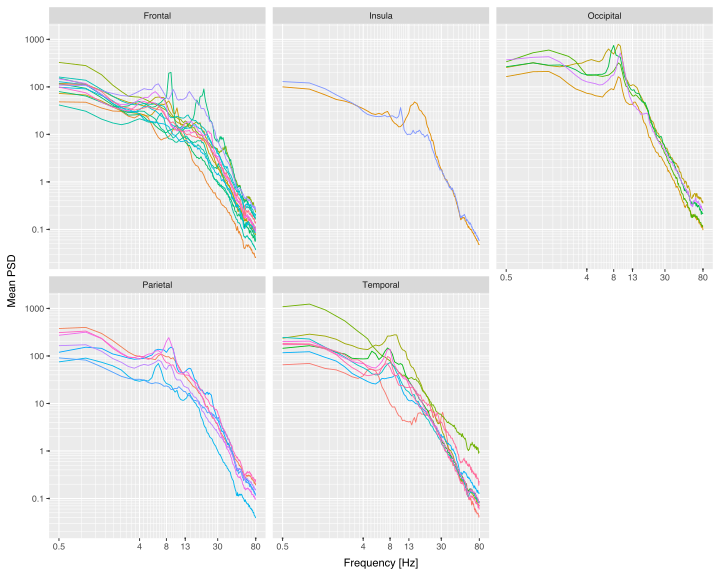

```{python}
#| label: imports
from pathlib import Path

import numpy as np
import pandas as pd
from specparam import SpectralGroupModel

from pesco.experimental.clustering import (
    cluster_bands,
    cluster_peak_frequencies,
    find_k_with_no_peak,
    get_no_peak,
    order_clusters_by_peak,
)
from pesco.experimental.peak_testing import (
    compute_intervals,
    cutintervals,
    test_lobes,
    test_regions,
    test_regions_heatmap,
)
from pesco.experimental.plotting import (
    plot_cluster_brain,
    plot_clusters,
    plot_clusters_pair,
    plot_histogram,
    plot_lobes,
    plot_region_difference_heatmap,
    plot_region_difference_heatmap_pair,
    plot_regions,
    plot_regions_per_lobe,
)
from pesco.io import load_sources, prepare_psd
from pesco.pipeline import DatasetCtx
from pesco.preprocess import compute_psd, normalize_psd
from pesco.spectral import remove_aperiodic, specparam2pandas

seed = 3
np.random.seed(seed)

PROJECT_DIR = Path("/Users/daniel/PhD/spectral-comparison/code/")
DATA_PATH_SOURCES = Path(f"{PROJECT_DIR}/data/Mantini2018")
DATA_PATH_IEEG = Path(f"{PROJECT_DIR}/data/Frauscher2018")

NO_PEAK_SUMMARY = "mean"
PLOT_SUMMARY = "median"

ieeg_raw = DatasetCtx(name="intracranial data (raw)")
ieeg_raw.f, ieeg_raw.psd = prepare_psd(
    matfile =  DATA_PATH_IEEG / "WakefulnessMatlabFile.mat",
    region_dict_file = DATA_PATH_IEEG / "RegionInformation.csv",
    frauscher_bandpass = False,
    normalize=False,
)
assert ieeg_raw.psd is not None

ieeg_raw.psd
```


### Oscillatory peak detection: after 1/f removal

```{python}
freqs = np.asarray(ieeg_raw.f, dtype=float)
psd_mat = ieeg_raw.psd.iloc[:, : len(freqs)].to_numpy(dtype=float)

fg = SpectralGroupModel(**SPECPARAM_SETTINGS)
fg.fit(freqs, psd_mat, freq_range=list(FREQ_RANGE), n_jobs=1)
fg.report()
```

```{python}
df = specparam2pandas(fg)
df["knee_freq"] = df["knee"] ** (1.0 / df["exponent"])
df
df["knee_freq"].hist()
```

```{python}
fig_dir = Path("figures/chapter2")
fig_dir.mkdir(parents=True, exist_ok=True)

p = plot_regions_per_lobe(ieeg_raw.psd, ieeg_raw.f)
p.save(fig_dir / "regions_per_lobe.svg", width=10, height=8, dpi=300)
p
```

{#fig-regions-per-lobe}

Intracranial and reconstructed sources from HD-EEG datasets themselves have different characteristics, so we used different settings for removing the 1/f background.
As orginally reported by @frauscher2018AtlasNormalIntracranial,the iEEG channel spectra exhibited a clear knee in log-log space , consistent with reports that knees are commonly observed in intracranial recordings. [@donoghue2024EvaluatingComparingMeasures; @bush2024AperiodicComponentsLocal]. We therefore  fit the iEEG spectra using Specparam's knee model. The HD-EEG  source-reconstructed spectra, by contrast, were approximately linear  in log-log space across the fitted frequency range and did not exhibit  a clear knee; we therefore used the fixed (no-knee) Specparam model  for these data, in line with standard practice for scalp/source M/EEG [donoghue2020ParameterizingNeuralPower].

For each channel, the normalized PSD was parameterised over 1-80 Hz with peak_width_limits = [1, 8] Hz, max_n_peaks = 8, peak_threshold = 3.0 (in units of standard deviation of the residual), and aperiodic_mode = "knee". 
In knee mode, the aperiodic component is modelled in log-power space as

$$L_\text{ap}(f) = b - \log_{10}\bigl(k + f^{\chi}\bigr),$$

where $b$ is the offset, $k$ the knee parameter, and $\chi$ the exponent governing the high-frequency roll-off. 
The fitted parameters $(b, k, \chi)$ were extracted per channel and used to reconstruct $L_\text{ap}(f)$ on the fitted frequency grid. The oscillatory residual was obtained by subtracting the aperiodic fit from the empirical log-PSD,


$$L_\text{osc}(f) = \log_{10} \text{PSD}(f) - L_\text{ap}(f),$$

which is the log-ratio of empirical power to the aperiodic component, equivalently $L_\text{osc}(f) = \log_{10}\bigl(\text{PSD}(f) / \text{PSD}_\text{ap}(f)\bigr)$. Values above zero indicate power exceeding the aperiodic fit; values below zero indicate power below it. This is the flattened spectrum in the sense of specparam.


The resulting $L_\text{osc}$ was carried forward to the clustering analysis without further normalisation, preserving the channel-relative scaling implied by the aperiodic subtraction.


<!-- Fit quality was assessed via the goodness-of-fit $R^2$ reported by specparam; across the iEEG channels, the median $R^2$ was 0.98, with 1765/1772 channels exceeding $R^2 \geq 0.9$.  -->

```{python}
#| label: ieeg-remove-aperiodic
# Afnan 2023-style 1/f removal: subtract the fitted aperiodic component
# in log10-power space. mode="log" -> L_osc = log10(PSD) - L_ap, the
# scale-free log-ratio residual (specparam flattened spectrum).
# mode="linear" available for IRASA-style normalised additive power.
osc_freqs, osc_mat = remove_aperiodic(fg, mode="log")

# Wrap as a DataFrame with the same channel index and metadata as ieeg_raw.psd.
# fg was fit on rows of ieeg_raw.psd in order, so rows align by position.
meta_cols = [c for c in ieeg_raw.psd.columns if isinstance(c, str)]
ieeg_osc = pd.DataFrame(
    osc_mat, index=ieeg_raw.psd.index, columns=osc_freqs
).join(ieeg_raw.psd[meta_cols])
ieeg_osc
```

### Fit ratio
```{python}
p = plot_regions_per_lobe(
    ieeg_osc, osc_freqs, y_label="$L_{osc}$", log_y=False
)
p.save(fig_dir / "regions_per_lobe_osc.svg", width=10, height=8, dpi=300)
p
```

Actually i want to fit alternative - normalized ratio
```{python}
ieeg_norm = DatasetCtx(name="intracranial data (normalized)")
ieeg_norm.f, ieeg_norm.psd = prepare_psd(
    matfile =  DATA_PATH_IEEG / "WakefulnessMatlabFile.mat",
    region_dict_file = DATA_PATH_IEEG / "RegionInformation.csv",
    frauscher_bandpass = False,
    normalize=True,
)
assert ieeg_norm.psd is not None
ieeg_norm.psd
```

```{python}
#| label: ieeg-norm-fit
freqs_norm = np.asarray(ieeg_norm.f, dtype=float)
psd_mat_norm = ieeg_norm.psd.iloc[:, : len(freqs_norm)].to_numpy(dtype=float)

fg_norm = SpectralGroupModel(
    peak_width_limits=[1, 6],
    max_n_peaks=8,
    peak_threshold=2.0,
    min_peak_height=0.3,
    aperiodic_mode="knee",
)
fg_norm.fit(freqs_norm, psd_mat_norm, freq_range=list(FREQ_RANGE), n_jobs=1)
fg_norm.report()
```

```{python}
#| label: ieeg-norm-remove-aperiodic
osc_freqs_norm, osc_mat_norm = remove_aperiodic(fg_norm, mode="linear")

meta_cols = [c for c in ieeg_norm.psd.columns if isinstance(c, str)]
ieeg_norm_osc = pd.DataFrame(
    osc_mat_norm, index=ieeg_norm.psd.index, columns=osc_freqs_norm
).join(ieeg_norm.psd[meta_cols])
ieeg_norm_osc
```

```{python}
p = plot_regions_per_lobe(
    ieeg_norm_osc, osc_freqs_norm, y_label="$L_{osc}$ (normalized)", log_y=False
)
p.save(fig_dir / "regions_per_lobe_osc_normalized.svg", width=10, height=8, dpi=300)
p
```


## HD EEG Data 

For the purpose of removing the 1/f background and testing if it improves the comparability we used the specparam algorithm. 

PSDs were parameterised using the specparam algorithm (formerly FOOOF; @donoghue2020ParameterizingNeuralPower) in fixed aperiodic mode. 
! We should use knee here as even frauscher describe the there was knee here.As it was noted by @frauscher2018AtlasNormalIntracranial

The algorithm fits an aperiodic component of the form

$$\log_{10} P(f) = b - \chi \cdot \log_{10}(f)$$

where $b$ is the offset and $\chi$ is the exponent, and then identifies periodic peaks above this background as Gaussian functions. The following settings were used:

- Fitting frequency range: 1-40 Hz
- Peak width limits: 1.0-8.0 Hz
- Maximum number of peaks: 6
- Minimum peak height: 0.1 (log power)
- Peak threshold: 2.0 standard deviations

```{python}
#| label: hd-load
# HD-EEG source data: load_sources returns an mne.Raw + channel metadata
# (Region name, Lobe, ...). Compute the PSD from the time series.
sources_raw, sources_meta = load_sources(DATA_PATH_SOURCES)
hd_data = sources_raw.get_data()
hd_fs = sources_raw.info["sfreq"]
hd_f, hd_psd = compute_psd(hd_data, hd_fs, fmin=0.5, fmax=80.0)

hd_psd_df = pd.DataFrame(
    hd_psd, index=pd.Index(sources_raw.ch_names, name="ch_name"), columns=hd_f
).join(sources_meta)
hd_psd_df
```

```{python}
#| label: hd-fit
# Fixed (no-knee) aperiodic mode for source HD-EEG; settings as above.
HD_FREQ_RANGE = (1.0, 40.0)
hd_freqs = np.asarray(hd_f, dtype=float)
hd_psd_mat = hd_psd_df.iloc[:, : len(hd_freqs)].to_numpy(dtype=float)

fg_hd = SpectralGroupModel(
    peak_width_limits=[1, 8],
    max_n_peaks=6,
    peak_threshold=2.0,
    min_peak_height=0.1,
    aperiodic_mode="fixed",
)
fg_hd.fit(hd_freqs, hd_psd_mat, freq_range=list(HD_FREQ_RANGE), n_jobs=1)
fg_hd.report()
```

```{python}
#| label: hd-remove-aperiodic
osc_freqs_hd, osc_mat_hd = remove_aperiodic(fg_hd, mode="log")

meta_cols_hd = [c for c in hd_psd_df.columns if isinstance(c, str)]
hd_osc = pd.DataFrame(
    osc_mat_hd, index=hd_psd_df.index, columns=osc_freqs_hd
).join(hd_psd_df[meta_cols_hd])
hd_osc
```

```{python}
p = plot_regions_per_lobe(
    hd_osc, osc_freqs_hd, y_label="$L_{osc}$ (HD-EEG)", log_y=False
)
p.save(fig_dir / "regions_per_lobe_osc_hd.svg", width=10, height=8, dpi=300)
p
```

For each region in each dataset, the primary aperiodic parameters of interest were the exponent ($\chi$) and offset ($b$). Oscillatory peaks were characterised by their centre frequency, power, and bandwidth. Model fits were evaluated using $R^2$ and mean absolute error; fits with $R^2$ below 0.90 were flagged for inspection.

exponents extracted from knee and fixed mode are not directly comparable, so for direct comaprison we thought about using the extraction with the sam setings .

### Aperiodic estimation: IRASA

As a complementary approach to specparam, the aperiodic component of each regional time course was estimated using Irregular Resampling Auto-Spectral Analysis (IRASA; @wen2016SeparatingFractalOscillatory). IRASA exploits the self-similar properties of fractal processes: the power spectrum is computed at multiple resampling factors ($h$ = 1.1 to 1.9 in steps of 0.05), and for each factor, the geometric mean of the up-sampled and down-sampled spectra is taken. The median across resampling factors yields the fractal (aperiodic) component, and the oscillatory residual is obtained by subtraction from the original spectrum.

The fractal exponent was estimated by fitting a line in log-log space to the IRASA-derived aperiodic spectrum over the 1-40 Hz range, matching the specparam fitting range. The slope (with sign reversed) provides an IRASA-based estimate of the aperiodic exponent.


