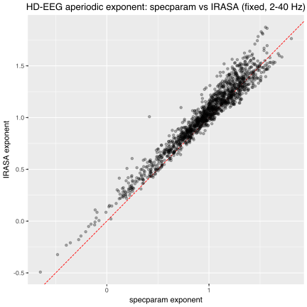

```{python}
#| label: setup
from pathlib import Path

import numpy as np
import pandas as pd
from specparam import SpectralGroupModel

from pesco.io import load_sources
from pesco.preprocess import compute_psd
from pesco.spectral import specparam2pandas

PROJECT_DIR = Path("/Users/daniel/PhD/spectral-comparison/code/")
DATA_PATH_SOURCES = Path(f"{PROJECT_DIR}/data/Mantini2018")

SPECPARAM_SETTINGS = dict(
    peak_width_limits=[1, 8],
    max_n_peaks=8,
    peak_threshold=3.0,
)

fig_dir = Path("figures/chapter2")
fig_dir.mkdir(parents=True, exist_ok=True)

# HD-EEG source data: load, compute PSD, build the matrix specparam needs.
sources_raw, sources_meta = load_sources(DATA_PATH_SOURCES)
hd_data = sources_raw.get_data()
hd_fs = sources_raw.info["sfreq"]
hd_f, hd_psd = compute_psd(hd_data, hd_fs, fmin=0.5, fmax=80.0)

hd_psd_df = pd.DataFrame(
    hd_psd, index=pd.Index(sources_raw.ch_names, name="ch_name"), columns=hd_f
).join(sources_meta)
hd_freqs = np.asarray(hd_f, dtype=float)
hd_psd_mat = hd_psd_df.iloc[:, : len(hd_freqs)].to_numpy(dtype=float)

```

### Aperiodic estimation: IRASA

As a complementary approach to specparam, the aperiodic component of the HD-EEG source data was estimated using Irregular Resampling Auto-Spectral Analysis (IRASA; @wen2016SeparatingFractalOscillatory). IRASA exploits the self-similar properties of fractal processes: the power spectrum is computed at multiple resampling factors ($h$ = 1.05 to 2.0 in steps of 0.05), and for each factor the geometric mean of the up-sampled and down-sampled spectra is taken. The median across resampling factors yields the fractal (aperiodic) component, and the oscillatory residual is obtained by subtraction from the original spectrum.

Because IRASA up-samples the signal by up to $h_\text{max} = 2$, the analysed band is bounded by the Nyquist limit, $h_\text{max} \cdot f_\text{hi} < f_s / 2$. With $f_s = 200$ Hz this restricts the upper edge to below 50 Hz, so the IRASA decomposition was run over 2-40 Hz — a narrower range than the 0.5-80 Hz specparam fit. The fractal exponent was obtained by fitting a line in log-log space to the IRASA aperiodic spectrum; the slope, sign-reversed, gives the IRASA exponent.

To compare the two parameterisations on equal footing, specparam was additionally refit in fixed aperiodic mode over the same 2-40 Hz band. The per-channel aperiodic exponents from specparam and IRASA are then compared by Pearson and Spearman correlation and a scatter against the identity line: close agreement indicates that the recovered aperiodic slope is method-independent, whereas a systematic offset would point to a method-specific bias.

```{python}
#| label: hd-irasa
from pesco.irasa import irasa2pandas, run_irasa

# IRASA upsamples by up to h_max=2, so the band is Nyquist-limited:
# band_hi * h_max < fs/2. With fs=200 the usable range is 2-40 Hz.
IRASA_BAND = (2.0, 40.0)
irasa_hd = run_irasa(hd_data, fs=int(hd_fs), band=IRASA_BAND)
irasa_hd_ch = (
    irasa2pandas(irasa_hd, fit_func="fixed")
    .drop_duplicates("ID")[["ID", "exponent", "gof_rsquared"]]
    .rename(columns={"exponent": "exponent_irasa", "gof_rsquared": "r2_irasa"})
)
irasa_hd_ch
```

```{python}
#| label: hd-specparam-irasa-band
# Refit specparam (fixed mode) over the IRASA band so the two exponents
# share the same frequency range and the same aperiodic model.
fg_hd_irasaband = SpectralGroupModel(**SPECPARAM_SETTINGS, aperiodic_mode="fixed")
fg_hd_irasaband.fit(hd_freqs, hd_psd_mat, freq_range=list(IRASA_BAND), n_jobs=1)

sp_hd_ch = (
    specparam2pandas(fg_hd_irasaband)
    .drop_duplicates("ID")[["ID", "exponent"]]
    .rename(columns={"exponent": "exponent_specparam"})
)
exp_cmp = sp_hd_ch.merge(irasa_hd_ch[["ID", "exponent_irasa"]], on="ID")
exp_cmp
```

```{python}
#| label: hd-irasa-vs-specparam
r_pearson = exp_cmp["exponent_specparam"].corr(exp_cmp["exponent_irasa"])
r_spearman = exp_cmp["exponent_specparam"].corr(
    exp_cmp["exponent_irasa"], method="spearman"
)
print("HD-EEG aperiodic exponent - specparam vs IRASA (fixed, 2-40 Hz)")
print(f"  Pearson r = {r_pearson:.3f}   Spearman rho = {r_spearman:.3f}")
exp_cmp[["exponent_specparam", "exponent_irasa"]].describe()
```

```{python}
from plotnine import aes, geom_abline, geom_point, ggplot, labs

p = (
    ggplot(exp_cmp, aes("exponent_specparam", "exponent_irasa"))
    + geom_abline(slope=1, intercept=0, linetype="dashed", color="red")
    + geom_point(alpha=0.3)
    + labs(
        x="specparam exponent",
        y="IRASA exponent",
        title="HD-EEG aperiodic exponent: specparam vs IRASA (fixed, 2-40 Hz)",
    )
)
p.save(fig_dir / "hd_exponent_specparam_vs_irasa.svg", width=6, height=6, dpi=300)
p
```

{#fig-hd-exp-specparam-irasa}
