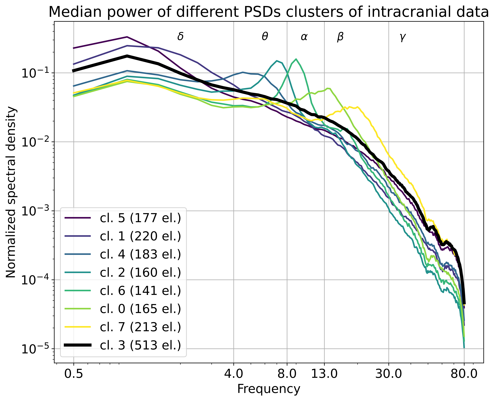
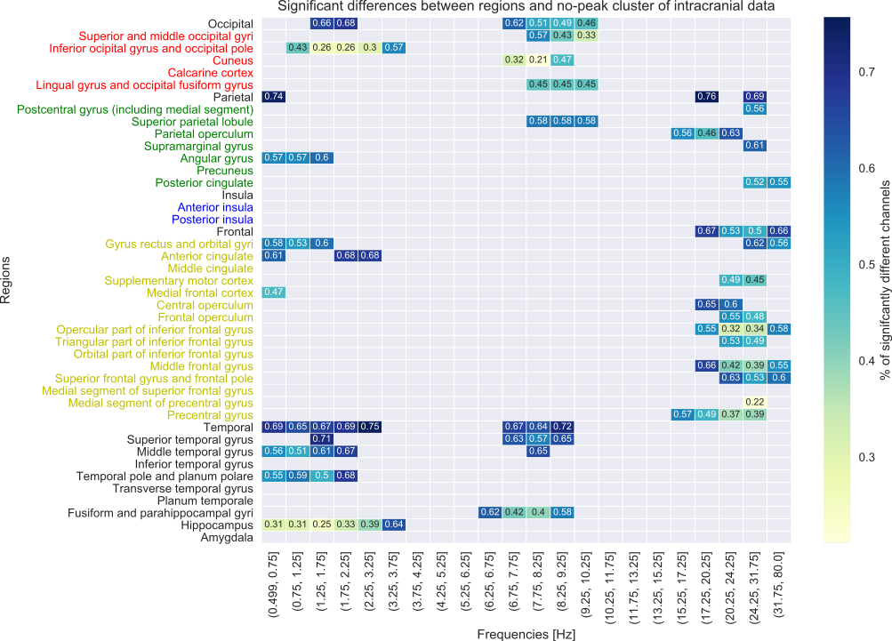
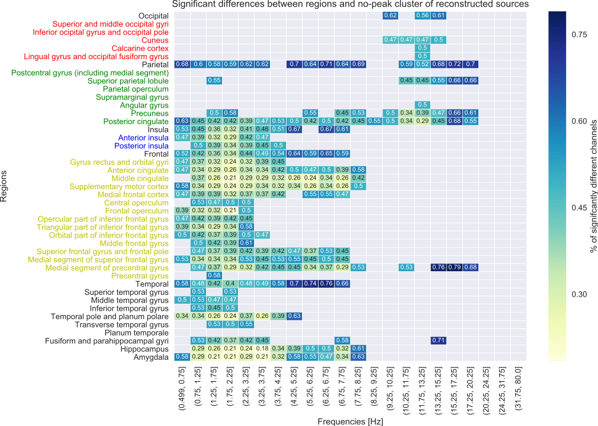
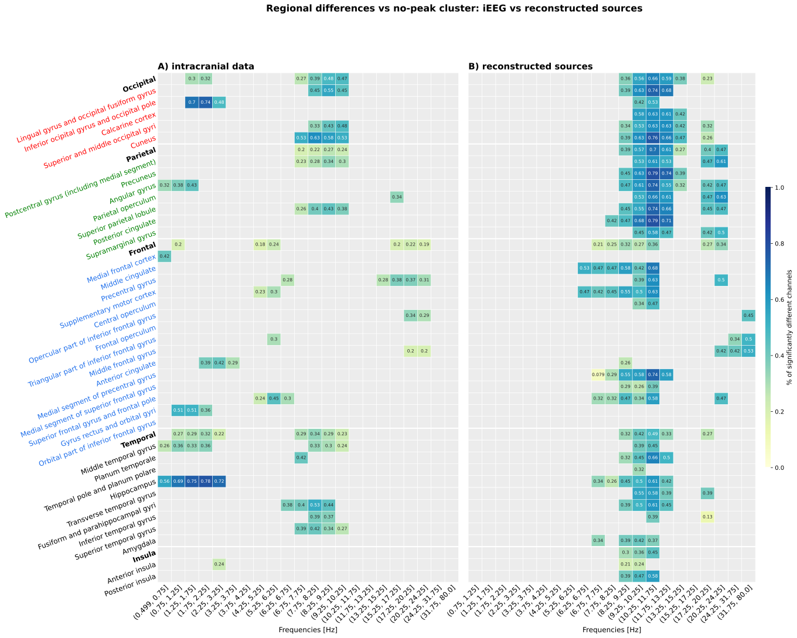

# Mapping Oscillatory and 1/f Broadband Spectral Features Across Cortical Regions and Recording Modalities {#sec-chapter2}

## Introduction

Cortical organisation organisation of the  brain is often defined by cytoarchitecture and connectivity. However, cortical regions also differ in their intristic activity, including their   electrophysiological dynamics in the resting state. Intracranial recordings show that different brain areas have distinct spectral profiles: characteristic patterns of oscillatory peaks and broadband spectral shape that  together shape regional electrophysiological signatures [@frauscher2018AtlasNormalIntracranial; @groppe2013DominantFrequenciesResting]. The importance of understanding resting-state intristic activity also help in understanding/predicting  task response [@immink2021RestingstateAperiodicNeural] and the is often used and basic for comparison when looking for biomarkers to detect early disease onset, of as the help in diagnosis.

An important reference point for understanding these signatures is a normative atlas of intracranial EEG published by @frauscher2018AtlasNormalIntracranial. This atlas initially included 1785 channels from 106 epilepsy patients, distributed across 38 cortical regions during resting wakefulness with eyes closed. Using k-means clustering and comparison against a no-peak reference set, the authors identified region-specific patterns of oscillatory peaks across canonical frequency bands. They also characterised the non-oscillatory component of the signal using a scale-free model. This atlas remains one of the most comprehensive open-access resources for normative iEEG spectral features, and it provides a useful external reference for evaluating spectral maps obtained with non-invasive methods. Comparing these features across recording modalities is methodologically difficult. iEEG provides a relatively direct measure of local field potentials with limited volume conduction, making it a useful reference for regional spectral organisation. Its signal quality advantage is substantial: @ball2009SignalQualitySimultaneously reported that the signal-to-noise ratio of invasive EEG is 20 to more than 100 times better than simultaneously obtained scalp EEG. However, iEEG is clinically constrained, spatially sparse, and biased by implantation coverage and patient populations.

In source-reconstructed MEG, similar regional structure has been documented through complementary descriptors. @keitel2016IndividualHumanBrain showed that resting-state spectral profiles are distinctive enough to fingerprint individual cortical areas. @mellem2017IntrinsicFrequencyBiases found that within most regions multiple frequency bands dominate at once, so regional identity is distributed across the spectrum. @mahjoory2020FrequencyGradientHuman reported, across 187 participants, a posterior-to-anterior decrease in dominant peak frequency that anticorrelates with cortical thickness as a proxy for hierarchical level. @niso2019BrainstormPipelineAnalysis demonstrated that source-space MEG power maps of this kind are reproducible with a standardised pipeline. @shafiei2023NeurophysiologicalSignaturesCortical brought this picture even sharper linking intrinsic electrophysiological activity in MEG   with cortical micro-architecture. This approach have however still some limitation,as  the orginal papers discussed  and  @tait2021SystematicEvaluationSource s that source reconstruction can introduce systematic distortions and variability  that propagate into spectral parameterisation.

Source-reconstructed HD-EEG, by contrast, like MEG is non-invasive method  and can provide whole-head coverage, but source reconstruction   can introduce spatial blurring and method-specific biases that affect the estimated spectral profiles [@liu2018DetectingLargeScaleBrain; @lai2018ComparisonScalpSourcereconstructed; @piastra2020ComprehensiveStudyElectroencephalography]. While  MEG will provide a lot of excellent qualities  most labs  while have not access to it due to its costs, and there the question about spatial organisation of oscialltions is less  established. The present chapter uses @@frauscher2018AtlasNormalIntracranial as a benchmark for source-reconstructed high-density EEG. The aim is not only simply to ask whether non-invasive recordings can reproduce intracranial spectral maps. Rather, this chapter is one part of the broader thesis question of how oscillatory and 1/f broadband features of the power spectrum should be quantified, interpreted, and compared across datasets. 

Source-reconstructed HD EEG is useful for this purpose because it provides a non-invasive estimate of cortical activity that is realively easy  and cheaply available and used, but reconstructed sources are not always reliable. Their spatial and spectral properties depend on the inverse method, electrode density, head model, signal-to-noise ratio, and spatial leakage. Therefore, the chapter treats cross-modal comparison not as a simple validation exercise, but as a way to examine which spectral features are robust to changes in recording modality and which are more sensitive to the assumptions of spectral parameterisation and source reconstruction. the initial work in this chapter was done at the beginning of the phd project, with the update in 2026.

Related work provides useful points of comparison for the present chapter. @afnan2023ValidatingMEGSource validated MEG source imaging of resting-state oscillatory patterns against the Frauscher iEEG atlas. Using 45 healthy participants and the same 38 regions of interest, they found that MEG-estimated spectra were more comparable to iEEG after aperiodic components were removed, and that lateral regions were recovered more accurately than deep or medial structures. @janiukstyte2023NormativeBrainMapping presented source-localised resting-state scalp EEG maps and showed that systematic spatial variation in spectral features can be detected with scalp EEG, although with reduced spatial specificity. These studies show that regional spectral organisation can be partly preserved across modalities. In the present chapter, they are treated as converging benchmarks rather than as the original motivation: the focus here is specifically on the HD-EEG source-reconstruction pipeline used in this thesis and on the separation of periodic and aperiodic spectral features.

Given certain assumption about the signal, the power spectrum may be operationally decomposed into two component types: narrowband rhythmic oscillations and a broadband (power deacreasing with frequency 1/f-like) background. Classical analyses focused predominantly on oscillations, but the broadband component also carries meaningful neurophysiological information [@donoghue2020ParameterizingNeuralPower]. As we discussed in Chapter 1, this separation is operationally useful but rests on modelling assumptions that do not guarantee the two components types reflect independent physiological processes. Still, failing to model the broadband background can produce apparent  difference in oscillatory peaks that actually reflect spectral variation in the background rather than true  difference to narrowband rhythms. Conversely, temporally varying oscillatory activity can contribute to what looks like broadband structure.

The $1/f$ like broadband component also shows regional structure. @frauscher2018AtlasNormalIntracranial found regional variation in the scale-free component  of intracranial EEG, including stronger scale-free values in visual regions (also observing the knee-like structrure in low frequencies of the spectrum). @armonaite2026ScaleFreeNeurodynamicsFunctional extended this line of work by showing that scale-free spectral properties across brain regions can serve as regional functional fingerprints, with the high-frequency exponent distinguishing cortical from subcortical areas. These findings suggest that regional electrophysiological identity may be expressed not only in oscillatory peaks, but also in broadband parameters such as spectral slope and offset.

This chapter addresses three questions: 
 - First, which aspects of  oscillatory regional spectral organisation reported in intracranial recordings are also visible in source-reconstructed HD-EEG? Does accounting for  spectral broadband (removing like Afnan did) will improve the matching? Will looking directly at the promprtion of parametrized peak in th band better tha unsupervised cluster
 - Second, do oscillatory and aperiodic features show comparable spatial organisation, or do they reveal different aspects of cortical spectral structure? Third, how do different ways of quantifying oscillatory activity relate to one another once broadband 1/f structure is modelled?

To answer these questions, I compare spectral features across the Frauscher iEEG atlas and source-reconstructed HD-EEG data. I examine both oscillatory and broadband components of the power spectrum, using the original Frauscher-style peak detection procedure alongside spectral parameterisation. To assess robustness against methodological choices, I use two complementary decomposition approaches: specparam and IRASA. As discussed in Chapter 1 (@sec-specparam-geometry), the parameters produced by these methods are model- and range-dependent descriptors of spectral shape. The exponent depends on the frequency range over which it is estimated [@gerster2022SeparatingNeuralOscillations; @boncompte2026AperiodicExponentBrain], and the offset and exponent are structurally coupled by the geometry of the fit. These caveats apply throughout the chapter. Thus, the goal is not to treat any single parameter as a direct physiological quantity, but to determine which spectral features are regionally organised, which are preserved across modalities, and which are sensitive to the assumptions of the analysis pipeline.

There are some limitation in the realisation of current approach. The Frauscher iEEG atlas was recorded with eyes closed, whereas the HD-EEG dataset used here was recorded with eyes open. Eye state affects oscillatory activity, most strongly posterior alpha power, and may also affect aperiodic exponent and offset [@geller2014EyeClosureCauses]. Where cross-modal agreement is observed, it is therefore observed despite differences in recording condition. Where cross-modal agreement is weak, modality and condition cannot be fully separated with the data used here. This limitation is considered again in the Discussion.

## Datasets

### Intracranial data

The intracranial EEG data were obtained from the MNI Open iEEG Atlas [@frauscher2018AtlasNormalIntracranial], a normative resource compiled from 106 patients with refractory epilepsy  recorded at three centres. Only channels implanted in brain regions that were determined to be non-epileptogenic throughout the monitoring period were retained, yielding 1772 channels (13 channels were removed from intitial release as were later judged erroneus on visual inspection) distributed across 38 cortical regions defined by the MICCAI atlas. @fig-frauscher-atlas provides a spatial overview of channel coverage in the atlas, distinguishing depth/stereo-EEG contacts from cortical grid and strip contacts across both hemispheres.

These 38 regions were derived from the consolidation of 20 smaller MICCAI labels into 8 functional groups to ensure sufficient channel density (min. 5 per region), while 16 labels were omitted due to lack of coverage. For each channel, 60 seconds of resting wakefulness data with eyes closed were available.

![Spatial distribution of the MNI Open iEEG Atlas channels and regional reference centroids in MNI space. (**A**) Glass-brain visualization of the 1785 intracranial EEG channels, with depth and stereo-EEG contacts shown in blue and cortical grid/strip contacts shown in orange. For visualization, left-hemisphere channel coordinates were assigned negative x-values based on the hemisphere label. (**B**) Glass-brain visualization of the regional reference centroids used in the grouped regional analyses, shown as enlarged magenta markers.](figures/chapter2/frauscher_channels_and_centroids.png){#fig-frauscher-atlas fig-align="center" width="80%"}

Signals were band-pass filtered at 0.5-80 Hz and resampled to 200 Hz. Power spectral density (PSD) was estimated using Welch's method with 2-second Hamming windows and 50% overlap, resulting in a frequency resolution of 0.5 Hz. Spectral densities were normalised to unit total power, making them independent of signal amplitude. Full preprocessing details are given in @frauscher2018AtlasNormalIntracranial.

### Reconstructed sources

5 min  of eyes-open resting state EEG data were collected in 19 healthy young adult volunteers (age 28$+6 years, 14 females) with Ethics Committee of ETH Zurich approval. EEG signals were recorded at 1000Hz sampling rate using a 256channel HydroCel Geodesic Sensor Net by Electrical Geodesics (Eugene, Oregon, USA). 
The full details of collecting and preprocessing this dataset dataset were described in @samogin2019SharedConnectionspecificIntrinsic and  @samogin2020FrequencydependentFunctionalConnectivity.  The poor  chanels were  identified (0-13 pers subject) and interpolated, data was band-pass filtered within 1-80Hz range and biological artifact were removed using fixed-point ICA (FastICA) algorithm. The realistic head model was provided as input to the exact low-resolution brain electromagnetic tomography (eLORETA) algorithm ([@pascual-marqui2011AssessingInteractionsBrain], together with the  preprocessed EEG signals, to estimate brain activity in the source space at high-temporal resolution.

While the HD-EEG data were recorded with eyes open, the  following steps and timeseries extraction were chosen to  matche the iEEG atlas: source activity was extracted from reconstructed sources  using average coordinates from the  electrodes within 76 MICCAI-defined ROIs in MNI space,  resulting in 1444 virtual sensors, with the grouped regional reference coordinates illustrated in Figure @fig-frauscher-atlas, panel B.

For every virtual sensor 60s activity was extracted according to the parameters defined in Frauscher's paper (sampling frequency 200Hz). Spectral densities were computed using identical Welch parameters (2s windows, 50% overlap, 0.5 Hz resolution). 

All spectral data were normalized to unit total power to ensure that the comparison focused on the distribution of frequency peaks (e.g., the occipital alpha or hippocampal delta) rather than absolute amplitude differences between scalp and intracranial sensors.

## Methods

### Clustering 

#### Oscillatory peak detection:  k-means clustering

To enable direct comparison with the original atlas results, the peak detection procedure of @frauscher2018AtlasNormalIntracranial was reproduced. The normalised power spectra were classified into $k$ groups using the k-means algorithm, with 160 features corresponding to the frequency steps from 0.5 to 80 Hz in 0.5 Hz increments, using Euclidean distance and 100 repetitions. The classification was repeated with increasing $k$ until a group without peaks was identified, defined as the group whose mean normalised spectrum was lower than the maximum among the other groups. The 50% of channels closest to the group mean were retained as the no-peak set.

The 160 frequency bins were grouped into 22 frequency intervals based on the condition that each bin contains at least 4% of total mean power, yielding boundaries at 0.5, 0.75, 1.25, 1.75, 2.25, 3.25, 3.75, 4.25, 5.25, 6.25, 6.75, 7.75, 8.25, 9.25, 10.25, 11.75, 13.25, 15.25, 17.25, 20.25, 24.25, 31.75, and 80 Hz. The presence of a peak in a given frequency interval for a particular brain region was determined by comparing the distribution of spectral densities of all channels in that region against the distribution of the no-peak set at the same interval, using a one-sided two-sample Kolmogorov-Smirnov test at the 5% significance level with Dunnett's correction for multiple comparisons across 42 regions (38 cortical regions plus 4 lobes) and 22 frequency intervals.

For the HD-EEG source-reconstructed data, the same procedure was applied. However, the 22 frequency intervals proposed by @frauscher2018AtlasNormalIntracranial did not satisfy the 4% power condition for the reconstructed source spectra. New frequency bins satisfying this condition were therefore defined separately for HD-EEG dataset. This deviation from the original procedure is noted as a methodological caveat.

### Spectral parameterisation: specparam

PSDs were parameterised using the specparam algorithm (formerly FOOOF; @donoghue2020ParameterizingNeuralPower) in fixed aperiodic mode. 
! We should use knee here as even frauscher describe the there was knee here.

The algorithm fits an aperiodic component of the form

$$\log_{10} P(f) = b - \chi \cdot \log_{10}(f)$$

where $b$ is the offset and $\chi$ is the exponent, and then identifies periodic peaks above this background as Gaussian functions. The following settings were used:

- Fitting frequency range: 1-40 Hz
- Peak width limits: 1.0-8.0 Hz
- Maximum number of peaks: 6
- Minimum peak height: 0.1 (log power)
- Peak threshold: 2.0 standard deviations

For each region in each dataset, the primary aperiodic parameters of interest were the exponent ($\chi$) and offset ($b$). Oscillatory peaks were characterised by their centre frequency, power, and bandwidth. Model fits were evaluated using $R^2$ and mean absolute error; fits with $R^2$ below 0.90 were flagged for inspection.

### Aperiodic estimation: IRASA

As a complementary approach to specparam, the aperiodic component of each regional time course was estimated using Irregular Resampling Auto-Spectral Analysis (IRASA; @wen2016SeparatingFractalOscillatory). IRASA exploits the self-similar properties of fractal processes: the power spectrum is computed at multiple resampling factors ($h$ = 1.1 to 1.9 in steps of 0.05), and for each factor, the geometric mean of the up-sampled and down-sampled spectra is taken. The median across resampling factors yields the fractal (aperiodic) component, and the oscillatory residual is obtained by subtraction from the original spectrum.

The fractal exponent was estimated by fitting a line in log-log space to the IRASA-derived aperiodic spectrum over the 1-40 Hz range, matching the specparam fitting range. The slope (with sign reversed) provides an IRASA-based estimate of the aperiodic exponent.

### Computing correspondence

Regional aggregation and atlas-level correspondence

For each modality, spectral parameters were aggregated within atlas regions. For the iEEG atlas, parameters were averaged (mean) across all channels assigned to each of the 38 MICCAI regions. For the HD-EEG datasets, parameters were first computed per subject per label and then averaged across subjects to produce group-level regional estimates.

Cross-modal correspondence was quantified using Spearman rank correlations across regions. For each parameter (exponent, offset, peak prevalence per frequency band, dominant peak frequency), the vector of regional values from one modality was correlated with the corresponding vector from another modality, yielding a cross-modal correlation coefficient. Significance was assessed using permutation testing (10,000 permutations, shuffling region labels) to account for the small number of spatial units.

### Oscillatory re-analysis after aperiodic correction

To evaluate whether regional oscillatory patterns are robust to the presence of aperiodic structure, the oscillatory analyses were repeated on aperiodic-corrected spectra using two approaches:

1. **specparam correction.** The fitted aperiodic component was subtracted from each PSD, producing a flattened spectrum. The Frauscher peak detection procedure (k-means clustering, no-peak set, KS test) was then re-applied to these flattened spectra.

2. **IRASA correction.** The IRASA-derived fractal component was subtracted from each PSD, yielding the oscillatory residual. The same peak detection procedure was applied to this residual.

Stability of oscillatory findings was operationalised as follows: for each region × frequency bin combination, the presence of a significant peak before correction was compared with the presence of a significant peak after correction. Peaks that survived both corrections were considered robust; peaks that disappeared after correction were considered potentially confounded by aperiodic variation. This comparison was performed separately for the specparam and IRASA corrections, and the agreement between the two methods was assessed.

## Results

<!-- Results will be added once analyses are complete. The following sections
indicate the planned structure. -->

### Reproducing the Frauscher oscillatory atlas

The k-means clustering procedure applied to the iEEG atlas yielded eight spectral groups, closely matching the original classification reported by @frauscher2018AtlasNormalIntracranial. Seven groups were characterised by prominent peaks in one or more canonical frequency bands (delta, theta, alpha, low beta, high beta, gamma, and mixed), while one group - the no-peak set - exhibited a smooth, monotonically decreasing spectrum with no visible narrowband peaks. The overall structure of these clusters was highly similar to the published result, although the absolute scaling of normalised spectral density differed slightly. The no-peak set served as the reference distribution for all subsequent peak detection tests.

Applying the same procedure to the HD-EEG source-reconstructed data (Mantini dataset) yielded six spectral groups. The reduced number of clusters indicates a narrower range of spectral shapes than in iEEG, consistent with the spatial smoothing introduced by source reconstruction. The HD-EEG no-peak cluster had a flatter profile than its iEEG counterpart, with stronger concentration of power in the alpha range across most clusters, likely reflecting both the eyes-open recording condition and the dominance of posterior sources in the source model. @fig-cluster-comparison presents these clustering results side by side.

{#fig-cluster-comparison width=95%}

{#ieeg_clusters width=95%}

A methodological issue arose when applying the frequency binning procedure to the HD-EEG data. The 22 frequency intervals proposed by @frauscher2018AtlasNormalIntracranial were defined so that each bin contained at least 4% of total mean power in the iEEG data. This condition was not satisfied for the source-reconstructed spectra, where power was more concentrated in the alpha range and the higher-frequency bins fell below the 4% threshold. Dataset-specific frequency bins were therefore computed for the HD-EEG analyses, as described in the Methods. This deviation is noted as a caveat when comparing peak detection results across modalities.

### Regional oscillatory profiles

Peak detection was performed per region and frequency bin using the Frauscher procedure, separately for each dataset.

<!-- Peak frequency maps, peak prevalence by region and band, per dataset. -->

<!-- 

 -->

### Regional broadband profiles

Regional broadband parameters were estimated using both specparam (fixed mode, 1-40 Hz) and IRASA, and aggregated at the atlas-region level for each dataset.
<!-- specparam and IRASA exponent/offset maps for each dataset (iEEG, Mantini, Nencki).
Posterior-anterior gradients. Lobar-level comparisons.
specparam vs IRASA agreement within each dataset. -->

### Cross-modal correspondence

<!-- Scatter plots and Spearman correlations:
exponent, offset, peak prevalence, peak frequency
across iEEG vs Mantini, iEEG vs Nencki, Mantini vs Nencki -->

### Effect of aperiodic correction on oscillatory findings

<!-- Before vs after correction heatmaps.
Which peaks survive specparam correction, IRASA correction, or both.
Which bands / regions most affected. -->

<!-- ### Eyes-open vs. eyes-closed comparison (Nencki) -->

<!-- Within-dataset comparison of aperiodic and oscillatory parameters
across conditions. Magnitude of EO/EC effect relative to cross-modal differences. -->

## Discussion

### Regional spectral organisation reflects cortical hierarchy

<!-- Contextualise aperiodic and oscillatory gradients within the cortical hierarchy
literature (Mahjoory et al. 2020, Royer et al. 2025, Shafiei et al. 2020).
Link to microstructural features (myelination, cortical thickness).
Brief connection to the timescale hierarchy concept (refer to Chapter 1). -->

The finding that oscillatory profiles are regionally organised is consistent with alpha being tied to laminar and feedback/feedforward circuit architecture [@jensen2026AlphaRhythmPhysiology], implying that at least some of the regional oscillatory structure recovered here reflects broader circuit organisation rather than isolated narrowband generators.

### Partial cross-modal preservation and its limits

<!-- What drives agreement (large-scale gradients, dominant oscillations like alpha).
What drives disagreement (sampling bias, EO/EC, source model blurring, SNR).
How the Nencki replication strengthens or qualifies conclusions.
Comparison with Afnan et al. 2023 MEG validation findings. -->

### Aperiodic correction changes the interpretation of oscillatory findings

<!-- Which findings are robust across both correction methods.
Which bands / regions are most affected — and why.
Implications for the oscillation literature that does not account for aperiodic activity.
Convergence with Afnan et al. 2023 finding that MEG-iEEG agreement improves
after aperiodic removal. -->

### Methodological caveats and limitations

Spectral parameterisation depends on several modelling choices, including the
assumed aperiodic functional form, the fitting frequency range, and peak
detection thresholds. Results should therefore be interpreted with caution
[@donoghue2021MethodologicalConsiderationsStudying].

<!-- Additional caveats:
- Frequency binning issue (4% condition not met for HD-EEG sources)
- Different subjects, different conditions (EO vs EC)
- specparam fitting range dependence (link to Chapter 1 geometry argument)
- Source reconstruction differences (sLORETA vs eLORETA, individual vs template anatomy)
- No simultaneous recording dataset available
- Nonsinusoidal waveform harmonics as a possible confound in peak detection
- iEEG sampling bias: electrodes in epileptogenic regions excluded, but patient
  population may still differ from healthy controls -->

A subset of source-reconstructed spectra exhibited near-flat spectral slopes with exponents close to zero and low model fit quality (R² < 0.70). These spectra typically showed no clear 1/f structure and, where peaks were present, these were confined to the beta range. Such profiles are unlikely to reflect genuine neural dynamics with an unusually flat broadband component. More plausibly, they arise from source labels that receive little coherent neural signal after inverse modelling, so that the reconstructed time course is dominated by spatially smoothed noise or leakage from neighbouring regions [@tait2021SystematicEvaluationSource]. Recent biophysical modelling suggests that high-frequency broadband power in scalp EEG may not be neural in origin [@brake2025ContributionsActionPotentials; @brake2024NeurophysiologicalBasisAperiodic], and this concern extends to source-reconstructed data, where the inverse solution cannot recover signal that was not present at the sensor level. Fitting specparam's fixed aperiodic model to such spectra produces nominally valid parameter estimates, but these should not be interpreted as reflecting cortical broadband dynamics [@wilson2024ModelSelectionSpectral; @gerster2022SeparatingNeuralOscillations]. In the present analyses, sources with R² below 0.90 were flagged, and the sensitivity of regional results to the inclusion or exclusion of these low-quality fits was assessed. <!-- TODO state the outcome of this sensitivity check -->

## Conclusion

This chapter demonstrates <!-- TODO finalise once results are complete --> the
value of jointly examining oscillatory and aperiodic spectral features when
mapping regional brain activity. Regional spectral profiles show partial
preservation across iEEG and HD-EEG source-reconstructed recordings, suggesting
that large-scale spatial organisation is partly recoverable across modalities.
At the same time, accounting for the aperiodic background alters the
interpretation of oscillatory findings, highlighting the risk of conflating
broadband spectral variation with narrowband oscillations. These results
underscore the need for cautious, model-aware interpretation of parameterised
spectral measures in human EEG research.

## Ideas 

The posterior-to-anterior frequency gradient recovered here is consistent with reports from MEG using both parameterised (Mahjoory et al. 2020) and non-parametric data-driven (Capilla et al. 2022) approaches, and from iEEG using spectral parameterisation (Kalamangalam et al. 2020). Our finding that this gradient is partially preserved in HD-EEG extends the pattern across an additional modality and a coarser spatial resolution regime.

## References

::: {#refs}
:::
