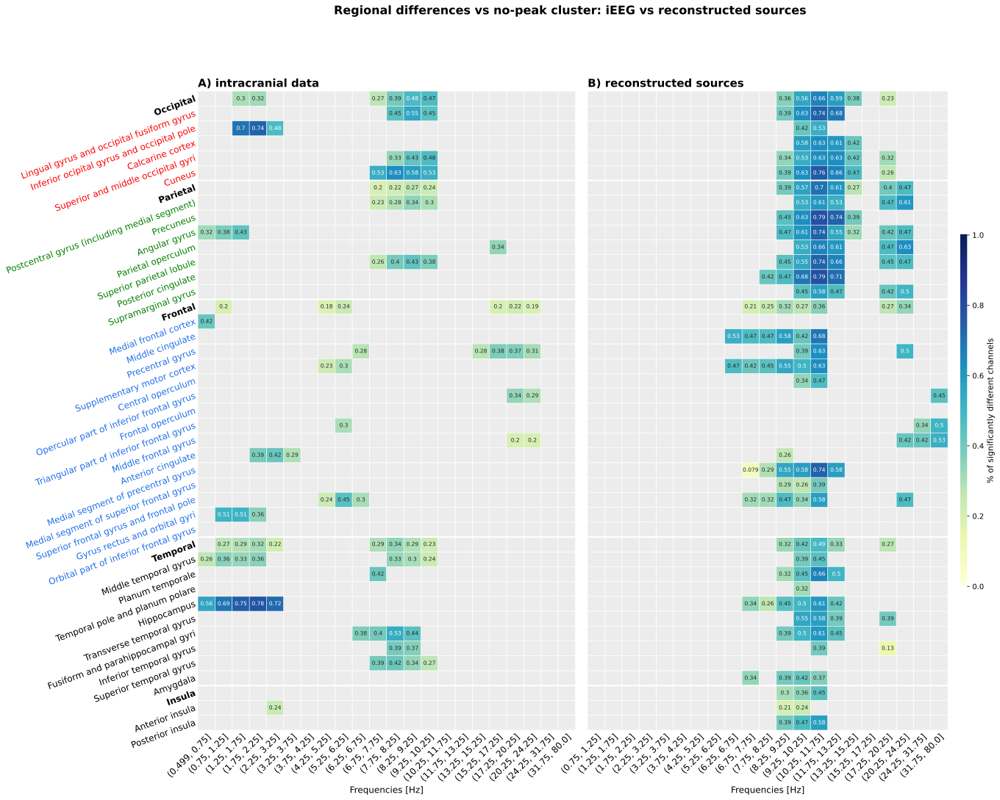
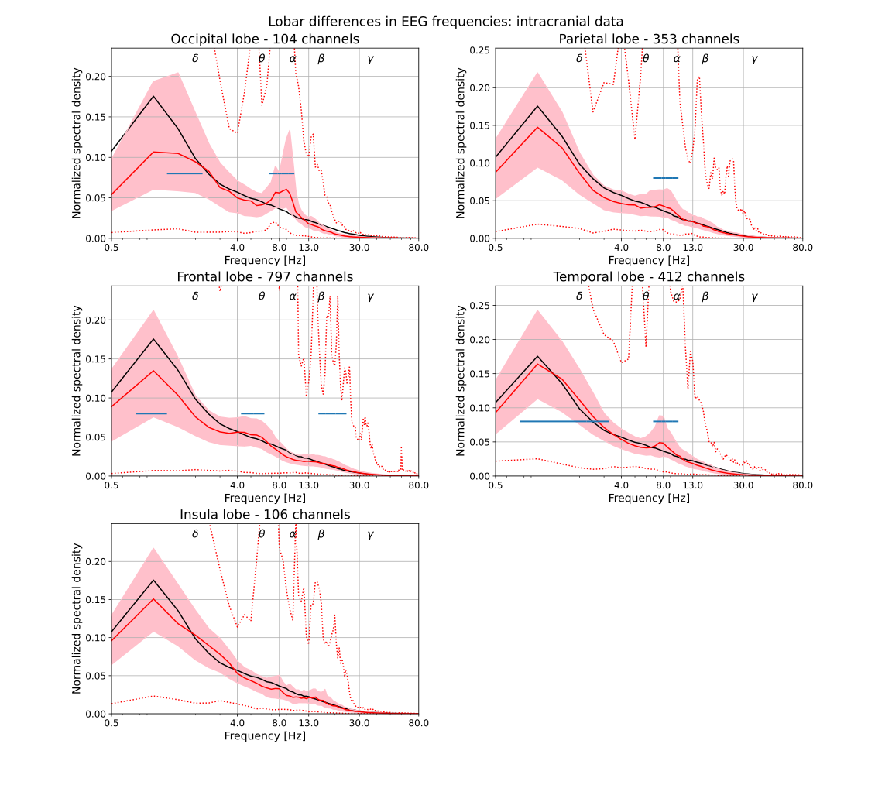
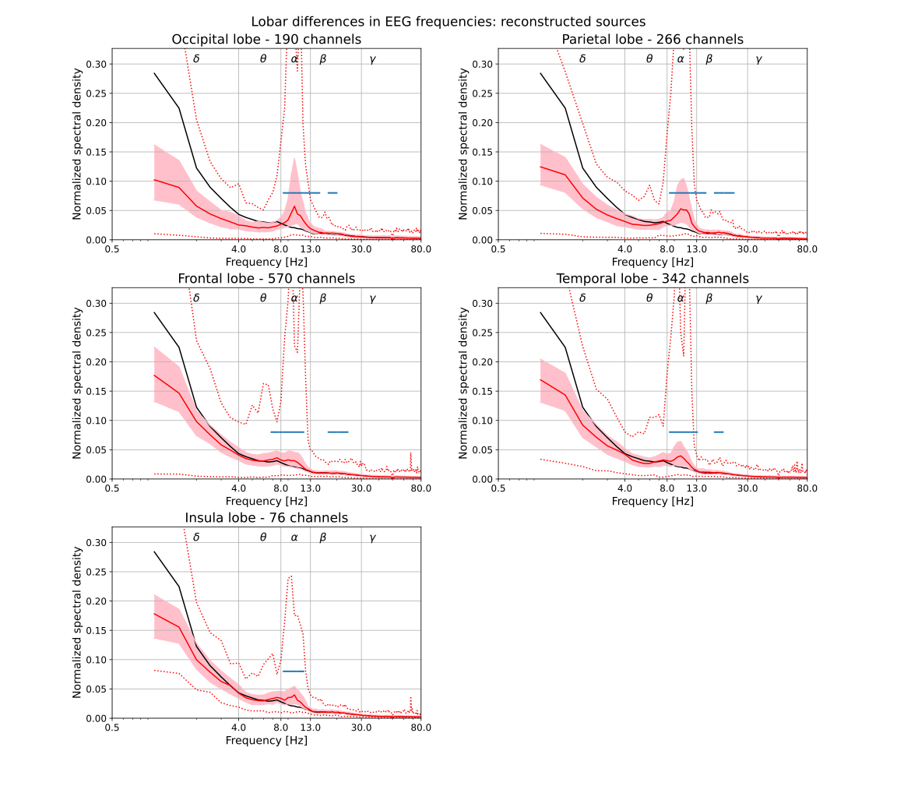

## Results

### Recovery of regional spectral organisation on uncorrected spectra

We first ask whether the regional spectral organisation of the iEEG atlas survives in source-reconstructed HD-EEG, before any aperiodic correction.

#### K-means clusterisation

The k-means clustering procedure was applied to the iEEG atlas with one deliberate departure from @frauscher2018AtlasNormalIntracranial: the
0.5-80 Hz bandpass filter used in the original study was omitted. Any bandpass filter introduces an amplitude transition near its cutoff frequencies, distorting the spectral shape at the low (0.5 Hz) and high (80 Hz) ends of the analysis range. Because k-means here operates directly on normalised spectral density across the full 0.5-80 Hz interval, such filter-induced shape changes are liable to be picked upby the clustering as structure rather than excluded from it.

To check that this deviation accounts for the differences from the
published result, the clustering was run in both configurations on the same data. With the 0.5-80 Hz bandpass applied, the procedure recovered the eight-group structure reported by
@frauscher2018AtlasNormalIntracranial: a no-peak group plus seven peak groups in the low delta, high delta, theta, alpha, low beta, high beta, and gamma bands. Without the bandpass, the procedure yielded seven groups: a no-peak group, two delta clusters, one theta cluster, two clusters with alpha-band peaks, and one beta cluster — with no gamma group and no separation of low from high beta. The unfiltered solution is taken forward as the more faithful description, since the clustering operates on undistorted spectra; the disappearance of the gamma cluster and of the low/high beta separation in the unfiltered run is consistent with these distinctions in the published atlas being driven, at least in part, by filter edge effects rather than by physiological structure. The 50% of channels closest to the mean of the no-peak group (unfiltered run) were retained as the no-peak reference set for all subsequent
peak-detection tests.

Applying the same procedure to the HD-EEG source-reconstructed data yielded 11 spectral groups, but their structure differed  from iEEG. There were seven clusters with with peak in  alpha 8-12 Hz dufferentiated by the amplitude of athe peak, indicating that the clustering over-segmented a single alpha-dominated continuum rather than resolving distinct bands, No distinct theta or beta clusters emerged (the band labels along the top axis are frequency guides, not cluster identities), and the sharp notch at 50 Hz reflects line-noise removal. The HD-EEG no-peak cluster had a flatter profile than its iEEG counterpart. @fig-ieeg-clusters presents the two clustering solutions side by side.

The cluster " band peak frequency" is the argmax of each cluster's spectrum relative to the no-peak baseline, which labels a cluster by its strongest oscillatory deviation and is only meaningful where a cluster carries a genuine peak. In the HD-EEG data only the δ and α clusters showed a clear bump above the aperiodic background; the remaining high-frequency clusters were distinguished not by a gamma oscillation but by a shallower aperiodic slope, producing an elevated broadband tail. For these clusters the elevated gamma shouldnt be read as genuine gamma oscillations. Whereas the iEEG atlas resolved a full bank of band-specific oscillatory clusters (δ→γ), the HD-EEG cluster structure was therefore dominated by alpha power and aperiodic slope.. @fig-ieeg-clusters presents these clustering results side by side.

{#fig-ieeg-clusters width="100%" column="page"}



Lobar differences presented as spectrum are presented below.

{#fig-ieeg-reg_dfiff width="100%" column="page"}

{#fig-hdeeg-reg_dfiff width="100%" column="page"}

#### Clustering stability and data driven intervals 

The cluster solution and the no-peak set were themselves sensitive to preprocessing and to the chosen fitting range: small changes in the upper or lower bound altered both the number of clusters and the membership and shape of the no-peak reference set (especially in hd eeg reconstructed sources where some configuratrion werent able to find the so called no-peak set ).

The 22 frequency intervals of @frauscher2018AtlasNormalIntracranial were defined so that each interval contained at least 4% of the total mean power in iEEG. When this data-driven rule was applied to the source-reconstructed HD-EEG spectra it failed to reproduce that structure: it yielded 21 intervals rather than 22 and, critically, placed five separate intervals above 31.75 Hz where the original atlas defines a single 31.75-80 Hz interval. This gamma over-segmentation is a consequence of the normalisation step. Because each channel spectrum is normalised to unit in-band integral, only spectral shape is retained and absolute power is discarded; channels then contribute to the mean in proportion to how their unit mass is distributed across frequency rather than to their signal strength. Source-reconstructed spectra have a shallower aperiodic slope and a relatively flat high-frequency noise floor, so a larger share of each channel's mass falls at high frequency, and low-SNR channels with weak alpha are the flattest and contribute the most relative gamma power. The averaged normalised spectrum is thus inflated above ~30 Hz and the cumulative-4% rule carves this noise-dominated tail into spurious narrow intervals. A robustness check confirmed the mechanism: replacing the mean with a median reference spectrum and restricting derivation to the physiological band (≤45 Hz) collapsed the spurious gamma intervals.

For this reason the 4% condition does not transfer to source-reconstructed data, and data-driven HD-EEG intervals are not directly comparable with the iEEG atlas. To preserve cross-modal comparability, the fixed 22 intervals of @frauscher2018AtlasNormalIntracranial were retained for both modalities in all regional peak-detection tests (@fig-hdeeg-reg_dfiff).

Because the clustering, the no-peak reference, and the interval definition were all unstable across reasonable preprocessing choices, this k-means peak-detection descriptor was not carried forward to the aperiodic-corrected (specparam) spectra. The downstream analyses instead characterise oscillatory content with the more stable per-band parametrised-peak descriptor, which requires neither a clustering step nor a no-peak reference and is therefore robust to these choices.

#### Band-power map and cross-modal overlap

We present regional relative band power, compared across modalities with the band-overlap metric.


Regional relative-power maps agreed across modalities most strongly in the alpha band (r = 0.60) and, more weakly, in the delta band (r = 0.42). Theta showed essentially no cross-modal correspondence (r = 0.13), beta only weak agreement (r = 0.30), and gamma was anti-correlated (r = −0.29). The spatial organisation of relative power is therefore only partially preserved between the iEEG atlas and source-reconstructed HD-EEG, and the preservation is band-dependent: it is confined largely to the alpha and low-frequency ranges that carry the clearest oscillatory structure, and breaks down at high frequencies. The negative gamma correlation is consistent with the high-frequency HD-EEG signal being dominated by a shallow aperiodic tail and noise floor rather than by physiological gamma — the same mechanism that drove the spurious gamma over-segmentation in the interval analysis — so that regions ranked high in HD-EEG gamma relative power are not those ranked high in the atlas. Relative to the identity line

These per-band correlations should be read as descriptive rather than inferential. Relative band powers are *compositional*: within each channel they are normalised to a fixed total, so the five bands are not independent and an increase in one band necessarily depresses the others. This closure constraint induces negative coupling between bands by construction — part of the negative gamma correlation is therefore arithmetic rather than physiological — and it violates the independence assumptions of ordinary correlation and t-tests applied to the raw proportions. Valid inference would require analysing the maps in a log-ratio space (e.g. centred or isometric log-ratio transforms), which also removes any dependence on the per-channel normalisation choice. We retain the untransformed maps here as a descriptive summary and defer formal cross-modal inference to the aperiodic-separated peak descriptors below, which are not subject to the same closure.


{#fig-afnan-overlap-raw}


### Periodic/aperiodic separation

Having established the uncorrected picture, we ask whether separating periodic from aperiodic activity changes which regional features are preserved.


#### Model-fit quality and low-quality sources

Both aperiodic modes were fit to every channel spectrum and compared before any band averaging, separating raw fit quality from penalised model selection (@tbl-model-selection). In the intracranial atlas the knee gave a large fit improvement — median $R^2$ rose from 0.93 (fixed) to 0.98 (knee) and per-channel MSE fell by 77% — so it is decisively preferred: median $\Delta\mathrm{BIC}$ (knee − fixed) = −225 (subject-clustered 95% CI [−242, −208]), with 96% of the 1,772 channels (106 patients) strongly favouring the knee. In source HD-EEG the knee improved fit only marginally: median $R^2$ rose from 0.942 to 0.948 ($\Delta R^2 = 0.005$) and MSE fell by ~7%. Its per-channel $\Delta\mathrm{BIC}$ was nonetheless formally 'strong' (median −7.7 — a Bayes factor of ≈50:1, or ~98% posterior probability for the knee per spectrum), but this is an artefact of the $N\log(\mathrm{MSE})$ term: with $N = 159$ fitted bins, even a 7% MSE reduction clears the Raftery 'strong' threshold once the single extra-parameter penalty is paid.

```{=typst}
#figure(
  table(
    columns: 3,
    align: (left, center, center),
    stroke: none,
    inset: (x: 8pt, y: 4pt),
    table.hline(stroke: 0.8pt),
    table.header(
      [], [*iEEG atlas* \ #text(0.8em)[(106 patients, 1772 ch.)]], [*source HD-EEG* \ #text(0.8em)[(19 subjects, 1444 ch.)]],
    ),
    table.hline(stroke: 0.5pt),
    table.cell(colspan: 3)[*Fit quality*],
    [median $R^2$, fixed], [0.928], [0.942],
    [median $R^2$, knee], [0.985], [0.948],
    [$Delta R^2$ (knee − fixed)], [0.053 \[0.047, 0.061\]], [0.005 \[0.003, 0.008\]],
    [MSE reduction (%)], [77.3 \[74.3, 80.0\]], [7.4 \[4.6, 11.8\]],
    table.hline(stroke: 0.3pt + luma(190)),
    table.cell(colspan: 3)[*Model selection: $Delta$BIC (knee − fixed)*],
    [median], [−225.1 \[−242.3, −207.8\]], [−7.7 \[−15.2, −2.9\]],
    [mean], [−225.6 \[−243.1, −208.9\]], [−11.0 \[−23.6, −0.0\]],
    table.hline(stroke: 0.3pt + luma(190)),
    [*Selected mode*], [*knee*], [*fixed*],
    table.hline(stroke: 0.8pt),
  ),
  caption: [Aperiodic model comparison per modality. $R^2$ and MSE are medians across channels; bracketed ranges are 95% subject-clustered bootstrap CIs (10,000 resamples). Negative $Delta$BIC favours knee.],
  kind: table,
) <tbl-model-selection>
```

The HD-EEG preference is also fragile. With only 19 subjects, resampling channels as if independent understates uncertainty: under subject clustering the median $\Delta\mathrm{BIC}$ interval widens from [−9.7, −5.9] (channel-level) to [−15.2, −2.9], and the mean from [−14.3, −7.6] to [−23.6, 0.0] — reaching essentially to zero. The per-channel split is correspondingly mixed: 52.5% [46.0, 59.4] strong-knee against 23.8% strong-fixed, with ~10% positive-fixed and ~8% weak. The median thus stays negative under clustering, but it rests on a negligible fit gain, so the knee's extra parameter is not warranted. We therefore retain the knee model for the iEEG atlas, where the advantage is large and robust on every measure, and the fixed model for HD-EEG, consistent with the convention for source-reconstructed scalp data [@donoghue2020ParameterizingNeuralPower].


#### Per-band peak prevalence from specparam

<!-- PLACEHOLDER: cross-modal comparison of peak prevalence per band and region (specparam peaks). Where do the two modalities agree/disagree once peaks are modelled explicitly rather than read off the raw PSD. -->

#### Cross-modal overlap before and after aperiodic correction

<!-- PLACEHOLDER: the H2 result proper. Report the change in band-overlap after subtracting the aperiodic component, per band and region, against the uncorrected overlap from 3.1.2. State whether overlap improves (as Afnan 2023 found for MEG) or degrades, and in which bands/regions. Log-ratio sensitivity comparison. -->


### H3: Stability of aperiodic estimates

Finally, we ask how far the aperiodic estimates themselves depend on the modelling choices made to obtain them.

#### Knee vs fixed

<!-- PLACEHOLDER: per-modality Pearson/Spearman between knee- and fixed-model exponents across channels. If relevant, whether the fixed exponent tracks knee frequency (cf. Ameen 2025). -->

#### Fitting range

<!-- PLACEHOLDER: per-channel agreement between 1-80 and 1-45 Hz fixed-mode exponents; magnitude and direction of the range effect; whether uniform or ROI-dependent. -->

#### IRASA vs specparam

<!-- PLACEHOLDER: Pearson/Spearman between IRASA (2-40 Hz) and specparam fixed-mode exponents refit over 2-40 Hz, in HD-EEG. -->
